# qemu-hse-asm-guide
Гайд на установку QEMU на Ваш новенький макбук (для самых маленьких)

Итак, для начала откройте `Терминал.app`. Без разницы как. Можно через спотлайт (Cmd + пробел и напишите в поиск "Терминал").

Если вы продвинутый 🤙🤙🤙 пользователь терминала на Mac, то у Вас уже стоит пакетник `brew`, но, скорее всего, нет. Поэтому пишем в терминал:

```
$ /bin/bash -c "$(curl -fsSL https://raw.githubusercontent.com/Homebrew/install/HEAD/install.sh)"
```

И перезагрузите терминал. Просто закройте и откройте. Можно даже не перезагружать макбук))

Теперь у вас должна работать команда

```
$ brew -h
```

Если он пишет что-то типа "bash: brew: command not found", то Вы что-то сделали не так.

Теперь установите сам QEMU:

```
$ brew install qemu
```

Если он что-то спросит и выведет что-то вроде `Continue? [Y/n]:` пишите `Y`.

Убедитесь, что Вы находитесь в корне:
```
$ cd ~
```

Теперь пишите:
```
$ qemu-img create -f qcow2 vm-disk.img 30G
```

Вместо `30G` можете указать любое другое значение -- это то, сколько гигов Вы хотите выделить под виртуалку. Советую зайти в настройки, и убедиться, что у вас там имеется место на SSD.

~~Теперь качайте Ваш любимый дистр линукса.~~ Качайте короче дебиан [здесь](https://cdimage.debian.org/debian-cd/current/amd64/iso-cd/debian-13.3.0-amd64-netinst.iso).
Как только оно скачалось, киньте его в `~` следующим образом:

```
$ mv ~/Downloads/debian-13.3.0-amd64-netinst.iso ~
```

Вот тут можно у флага `-m` можно указать `2048`, тогда виртулака будет жрать всего 2гб. Но лучше все же делать как здесь:

```
$ touch bootvm.sh
$ echo "qemu-system-x86_64 -m 8192 -drive file=vm-disk.img,media=disk -netdev user,id=net0,hostfwd=tcp::2222-:22 -device e1000,netdev=net0 -cdrom debian-13.3.0-amd64-netinst.iso" > bootvm.sh
```

Наконец запустите QEMU и молитесь, чтобы оно у вас заработало:
```
$ chmod +x bootvm.sh
$ sudo ln ~/bootvm.sh /usr/local/bin/bootvm
$ bootvm
```

> [!TIP]
> Везде, где `sudo` просит Ваш пароль (пин код от ноута), вводите его, это не мошенники.

# Установка Debian

Когда виртуалка запустилась, Вы увидите что-то вроде такого:

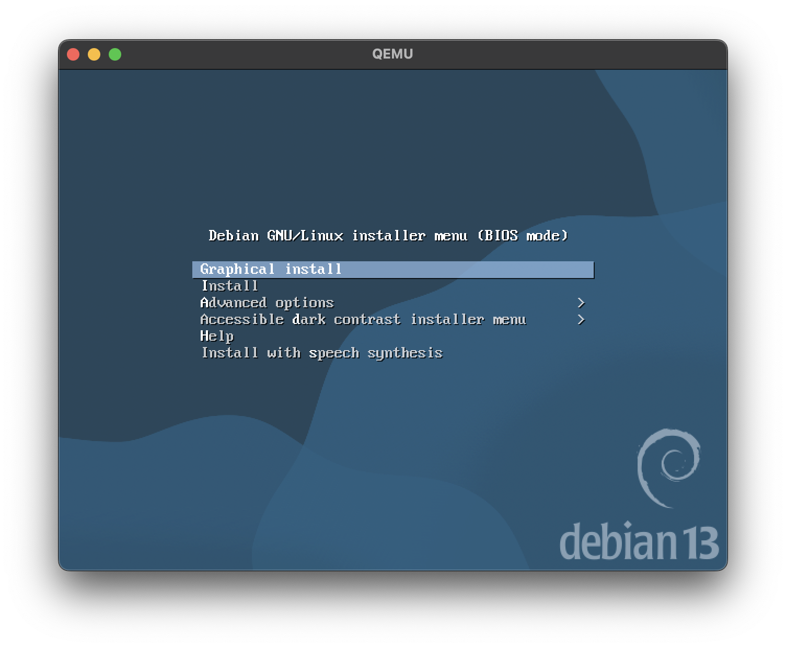

Тут главное выбрать `Graphical Install`.

Во всех следующих пунках можете выбирать на свое усмотрение, главное поставьте
раскладку American English, вам как-никак код писать надо.

Когда установщик предложит ввести хостнейм, можно вписать `qemu`:
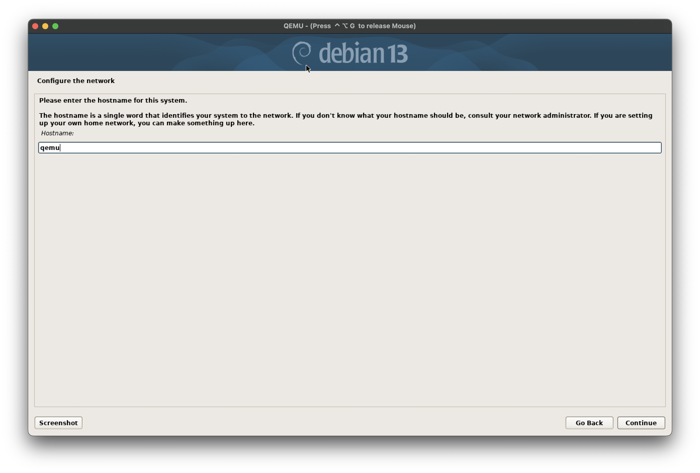

В имени домена пишем `.local`:
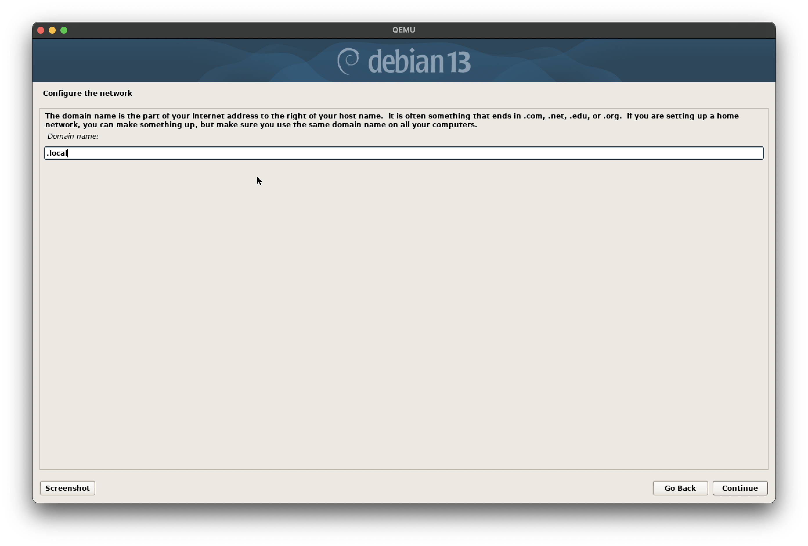


Установите пароль для `root`. Пароль рекомендую стваить крайне надежный: из четырех подряд идущих цифр. 1234 например:

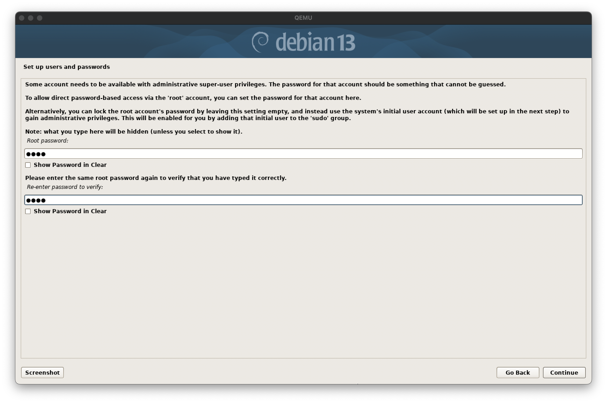

Дальше Вам предложат создать юзера и установить ему пароль. Просто делайте то, что просит Вас установщик.

> [!TIP]
> Советую поставить юзернейм `student`. Так будет проще на следующих этапах.

При форматировании диска, все делайте на одном разделе, как-то особенно размечать диск, да еще и на виртуалке, тупо не имеет смысла:

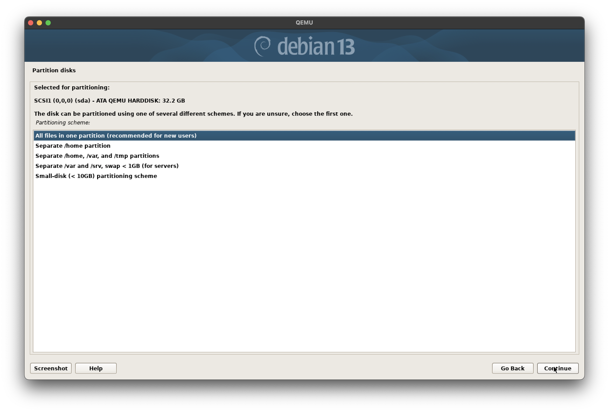

Везде жмем `Continue`.

Тут выбираем `Yes`. Боятся не нужно, Ваши файлы он не потрёт. Диск-то виртуальный:

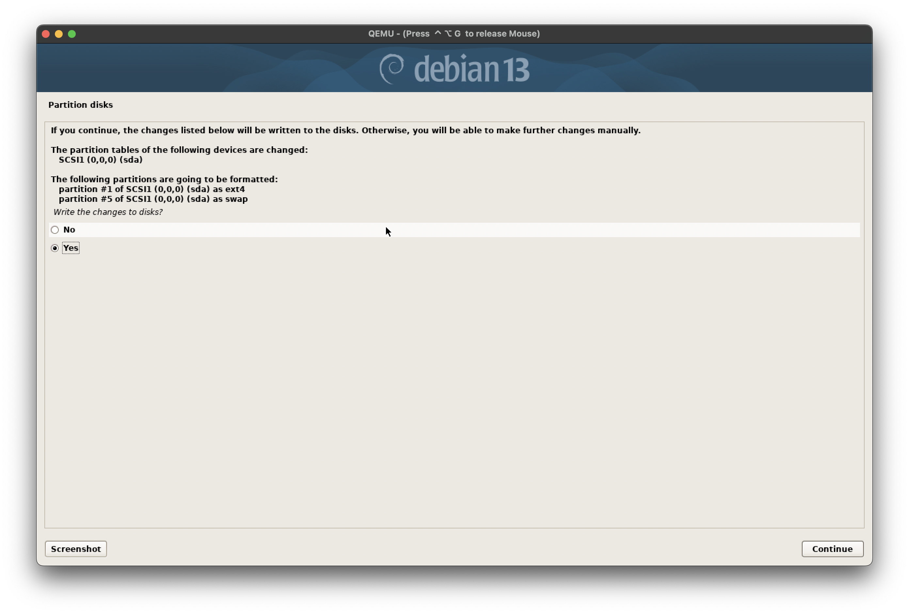

Когда дело дойдет до настройки пакетника, выберите Российское зеркало, чтобы пакеты не качались по часу:

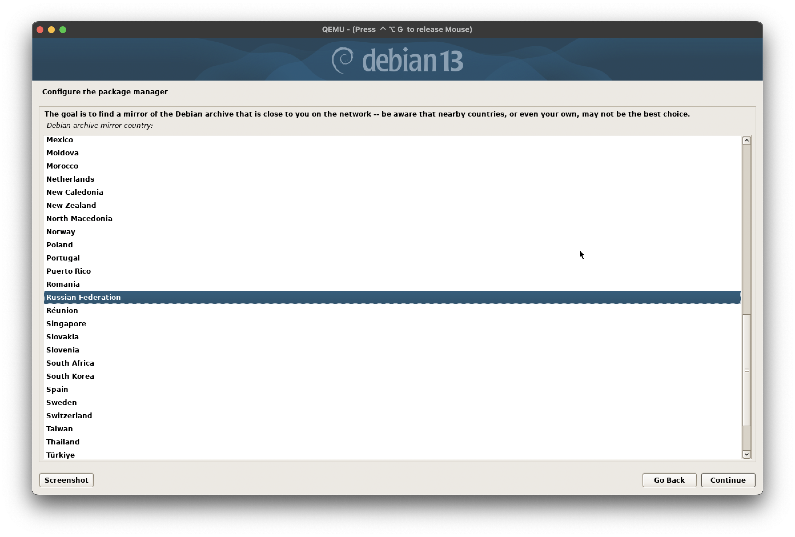

Как всегда, все остальное, что можно проскипать, скипаем кнопкой `Continue`.

На этапе предустановки софта, рекомендую проставить галочки следующим образом:

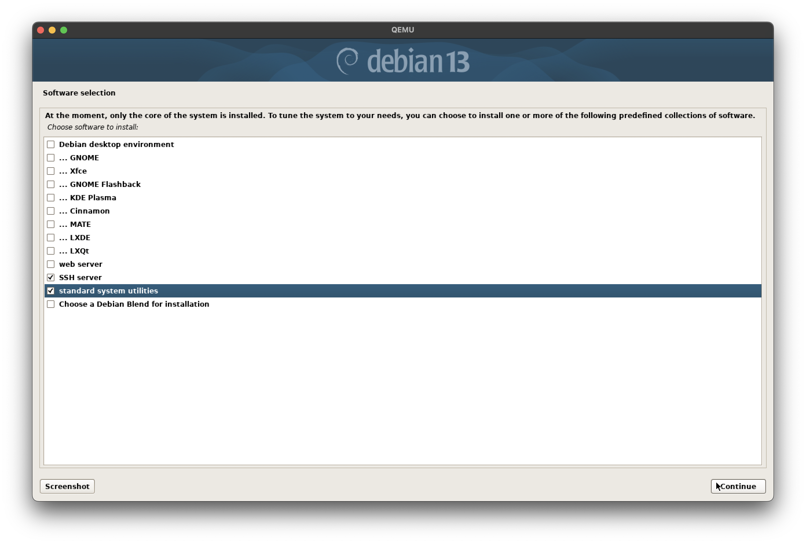

Если Вы планируете использовать "окошки" на самой виртуалке, то чекните пункты "Debian Desktop Environment" и на выбор
из GNOME/KDE/Xfce/...

Если же Вам нужно просто подрубаться по SSH в VSCode, то окна на виртуалке Вам явно не нужны.

При установке GRUB'a выберите (единственный) доступный диск:


Как только установка завершится, остается только нажать (угадайте какую кнопку?)

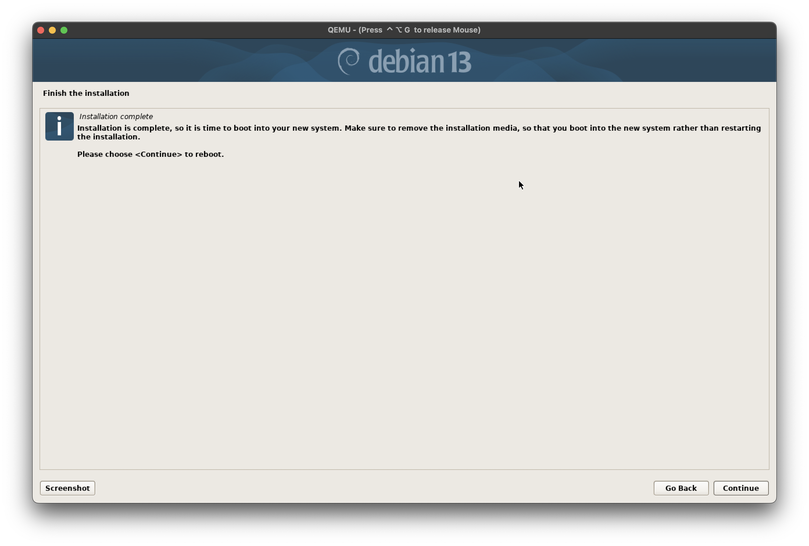

Как только система прохрюкалась, вы должны увидить такую картину:

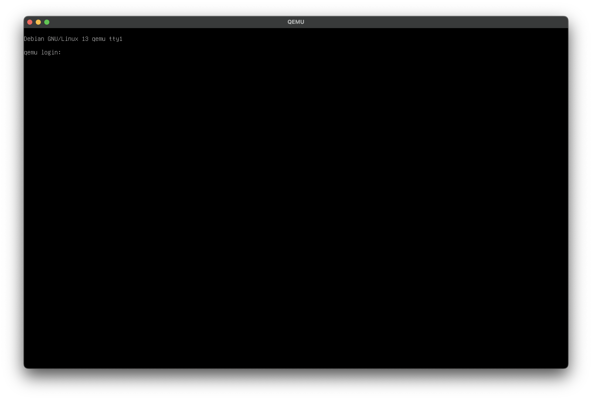

Теперь ввдите ваш юзернейм и пароль.

Если нет, то ~~я хз что делать~~ пишите мне в личку @timar07.

Осталось дело за малым...

# Подключение через SSH в VSCode

Откройте RemoteSSH (в левом нижне уголке VSCode):

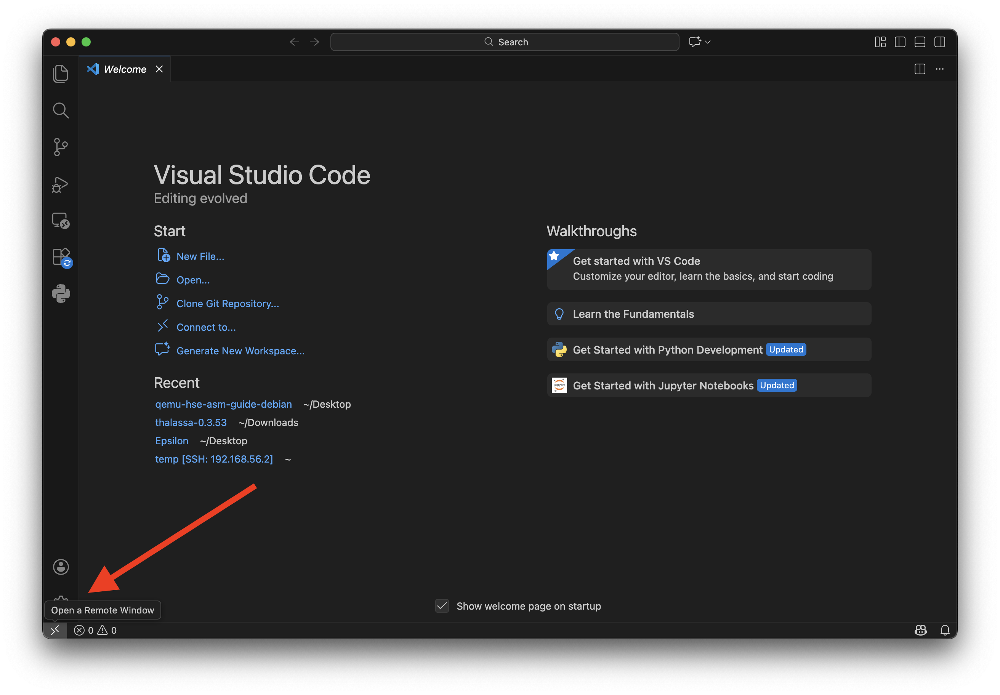

Далее: `Connect to Host -> Add New SSH Host` и пишите `ssh -p 2222 <ваш юзернейм>@localhost`.
Если вы укаазали юзернейм `student`, то нужно, соответственно, вписать `ssh -p 2222 student@localhost`.

> [!IMPORTANT]  
> Здесь и далее -- вместо `student`, можете вписать тот юзернейм, который вы предпочли указать.
> Если вы последовали рекомендации и создали `student`, то менять ничего не надо.

Далее в правом нижнем углу всплывет уведомление о добавлении нового хоста, тыкните `Connect`.

# Установка необходимых пакетов

К сожалению, разрабы этого шедевродистра не установили даже `ld`, поэтому нужно все скачать ручками.

Откройте терминал в VSCode (убедитесь, что вы подключены к виртуалке! В левом нижнем углу редактора должно быть написано `SSH: localhost`)

Для начала настроим права пользователя:

```
$ su root
<попросит Вас ввести пароль>
$ apt-get install sudo
$ sudo adduser student sudo
$ su student
```

Теперь Вы можете пользоваться `sudo`.

Установим все пакеты, необходимые для курса по ассемблеру:

```
$ sudo apt-get install nasm binutils make gcc
```

Если вы планируете также писать C++ на виртуалке, то:

```
$ sudo apt-get install g++ cmake
```

Если Вы дошли до сюда, то у Вас все получилось 🎉
