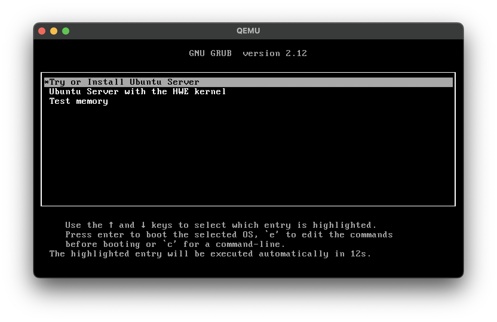
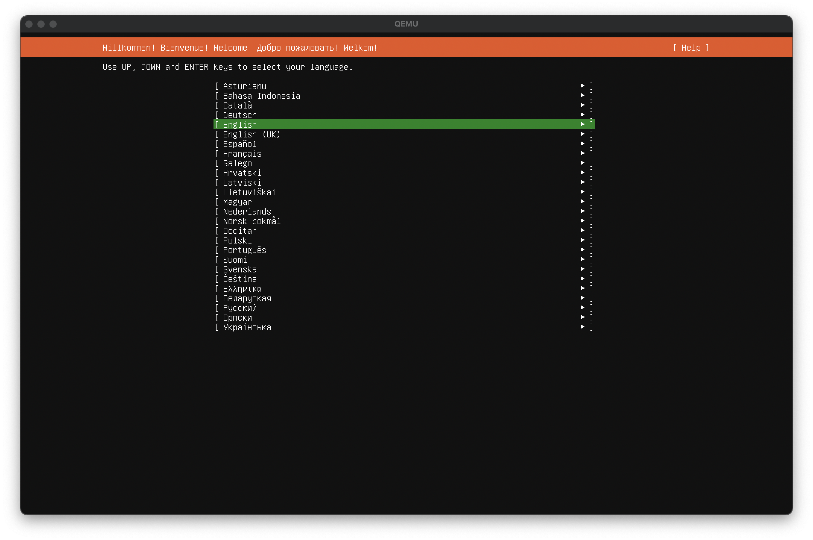
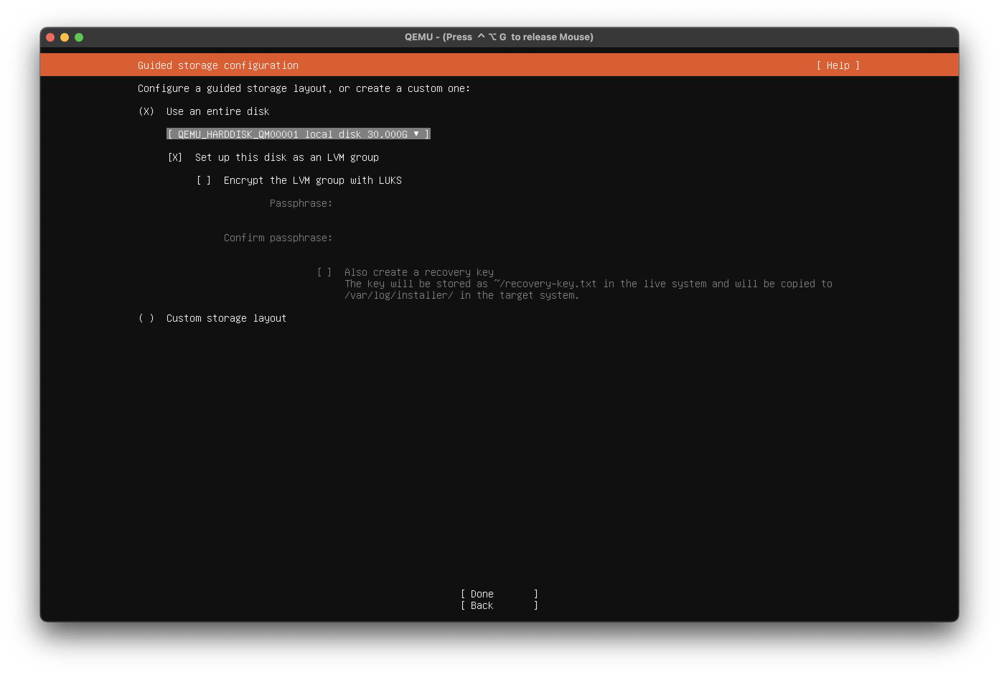
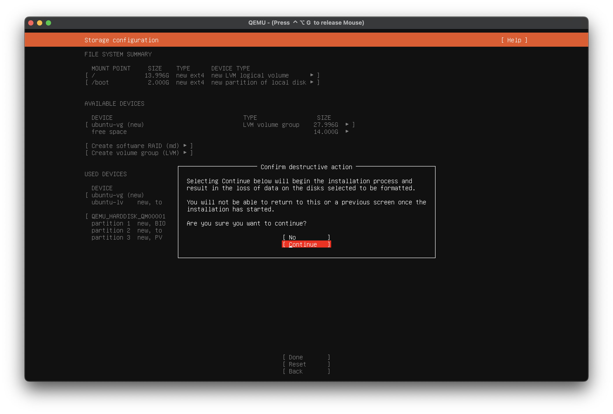
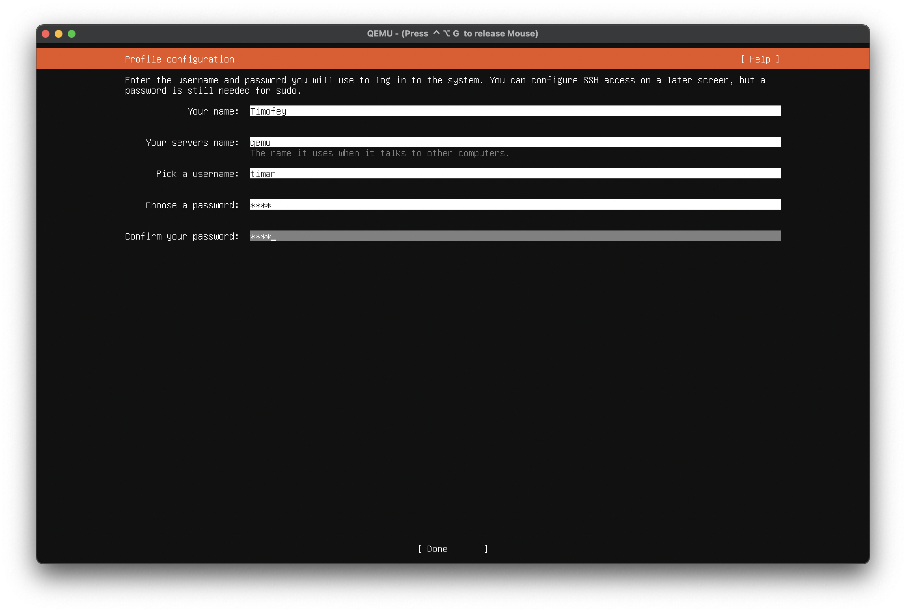
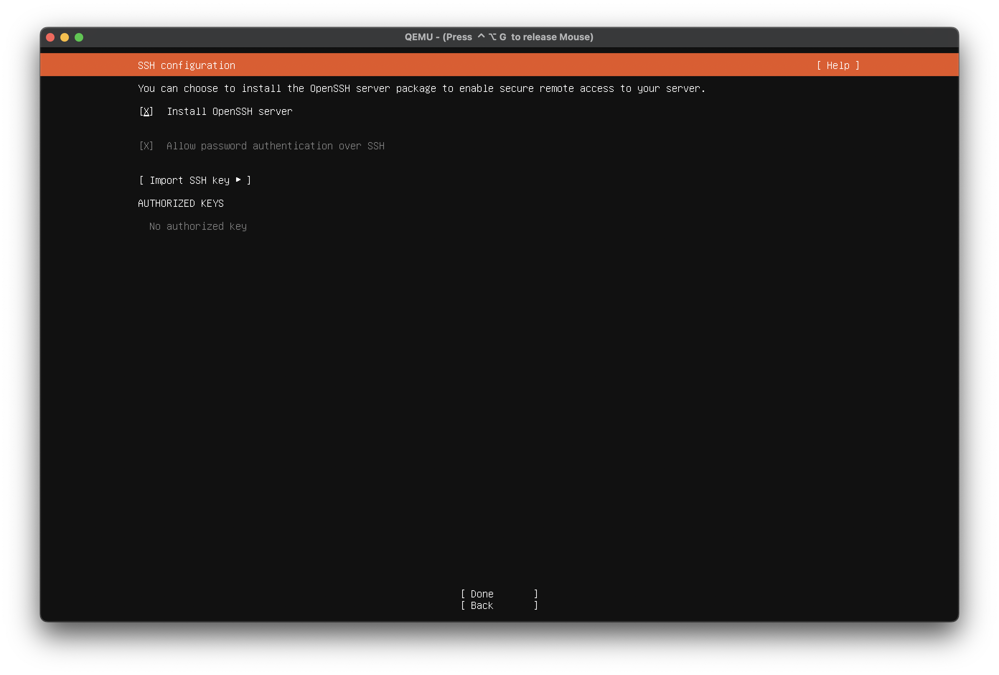
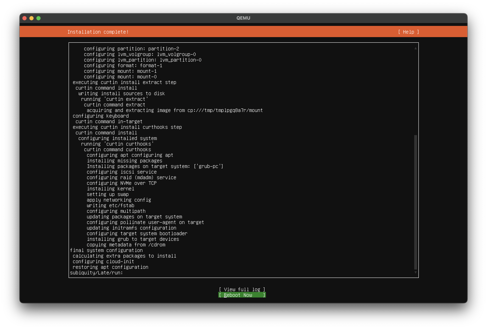
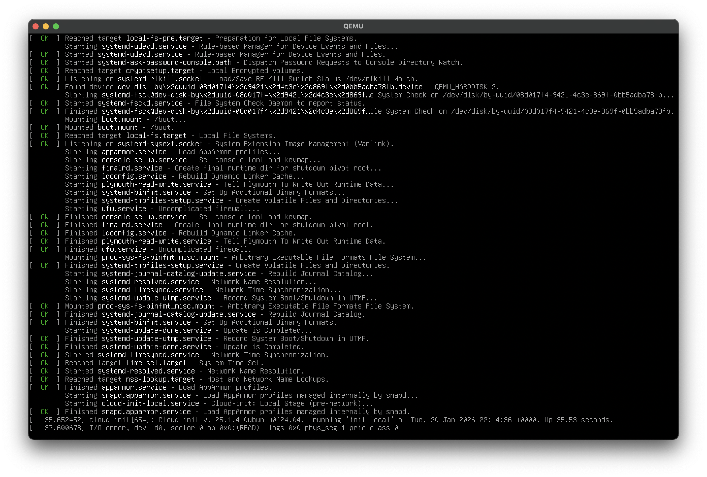
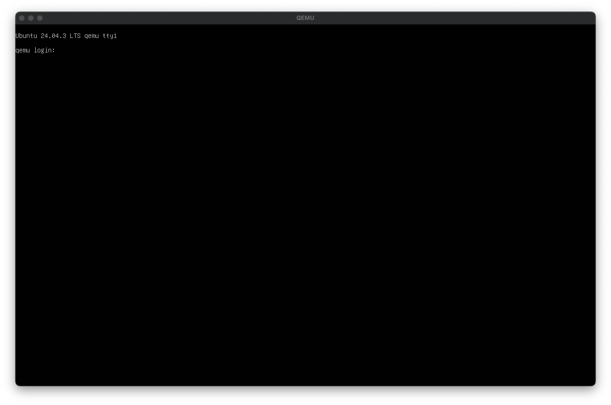

# qemu-hse-asm-guide
Гайд на установку QEMU на Ваш новенький макбук (для самых маленьких)

Итак, для начала откройте `Терминал.app`. Без разницы как. Можно через спотлайт (Cmd + пробел и напишите в поиск "Терминал").

Если вы продвинутый 🤙🤙🤙 пользователь, то у Вас уже стоит пакетник `brew`, но, скорее всего, нет. Поэтому пишем в терминал:

```
$ /bin/bash -c "$(curl -fsSL https://raw.githubusercontent.com/Homebrew/install/HEAD/install.sh)"
```

И перезагрузите терминал. Просто закройте и откройте. Можно даже не перезагружать макбук))))

Теперь у вас должна работать команда

```
$ brew -h
```

Если он пишет что-то типа "bash: brew: command not found", то Вы что-то сделали не так.

Теперь установите сам QEMU:

```
$ brew install qemu
```

Если он что-то спросит и выведет что-то вроде `Continue? [Y/n]:` пишите `Y`.

Убедитесь, что Вы находитесь в корне:
```
$ cd ~
```

Теперь пишите:
```
$ qemu-img create -f qcow2 vm-disk.img 30G
```

Вместо `30G` можете указать любое другое значение -- это то, сколько гигов Вы хотите выделить под виртуалку. Советую зайти в настройки, и убедиться, что у вас там имеется место на SSD.

~~Теперь качайте Ваш любимый дистр линукса.~~ Я вам слова не давал, так что качайте бубунту [здесь](https://ubuntu.com/download/server) (Ubuntu 24.04.3 LTS). Эта версия идет без окошек. Если присутствет неудержимое желание потыкать GNOME 42 да и в целом иметь графический интерфейс, то можете ставить [десктопную версию](https://ubuntu.com/download/desktop).
Как только оно скачалось, киньте его в `~` следующим образом:

```
$ mv ~/Downloads/ubuntu-24.04.3-live-server-amd64.iso ~
```

Вот тут можно у флага `-m` можно указать `2048`, тогда виртулака будет жрать всего 2гб. Но лучше все же делать как здесь:

```
$ touch bootvm.sh
$ echo "qemu-system-x86_64 -m 8192 -drive file=~/vm-disk.img,media=disk -net user,hostfwd=tcp::10022-:22 -cdrom ubuntu-24.04.3-live-server-amd64.iso" > bootvm.sh
```

Наконец запустите QEMU и молитесь, чтобы оно у вас заработало:
```
$ chmod +x bootvm.sh
$ sudo ln ~/bootvm.sh /usr/local/bin/bootvm
$ bootvm
```

> [!TIP]
> Везде, где `sudo` просит Ваш пароль (пин код от ноута), вводите его, это не мошенники.
> Кстати, по-моему, вместо пароля можно это сделать отпечатком пальца. Но это не точно.

# Установка Ubuntu (без графической оболочки)

Вообще, тут сложно что-то сделать не так, но на всякий случай, вот инструкция:

Перемещаемся стрелочками на клавиатуре (вверх/вниз), нужную опцию (активная опция подсвечивается) нажимаем кнопкой Enter.



Здесь можно выбрать язык. Все же записались на курс по английскому?



И дальше все более менее просто: выбирайте конопку `Done` или `Continue` (помните про стрелочки ↕️ и Enter).

Настройки диска должны получиться такими:



И отформатриуйте диск. Бояться нечего, диск все равно вирутальный:



Настройте профиль:



Установите имя пользователя и пароль. Пароль рекомендую стваить крайне надежный: из четырех подряд идущих цифр. 1234 например.

Также можно скачать OpenSSH:



Наконец, бубунта вам предложит перезагрузить компьютер. Соглашайтесь:



После этого делать ничего не надо. Просто ждите пока systemd раскумарится.

Спустя какое-то время, появится что-то такое:



Вас остается ждать. У меня это заняло около 5 минут.

Как только появилось вот это:



Введите Ваш логин и пароль. Если Вы дошли до сюда, то у Вас все получилось 🎉

Если нет, то ~~я хз что делать~~ пишите мне в личку @timar07.

Осталось дело за малым...

TODO: Вот тут надо показать как через VSCode подключиться

# Установка необходимых пакетов

```
$ sudo apt-get install nasm binutils
```
